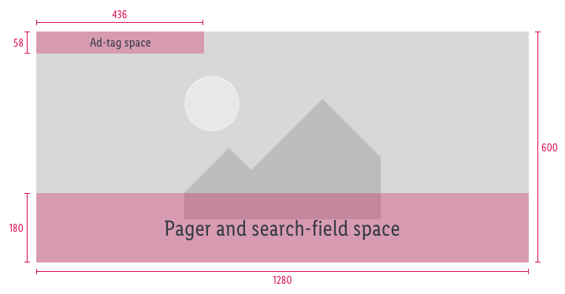
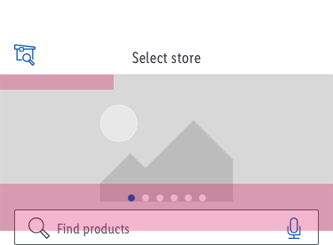
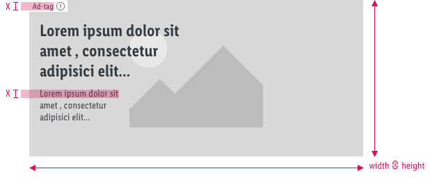
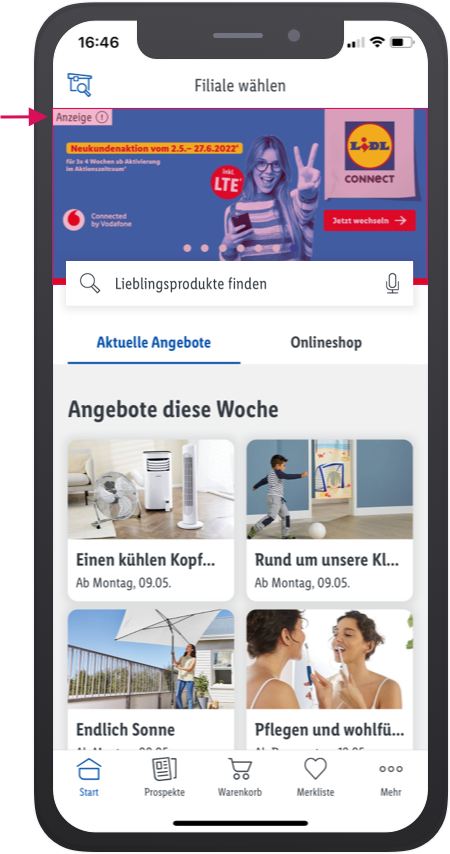

# Hero Start page

Ad/s on the start page are positioned in the hero slider at the top.

- Ad must be marked with the [ad-tag](/Lidl/App/Design/Components/Ad-tag/Ad-tag.md).
- The ad links to internal sites only.

---

## Safe zone (iOS and Android)

The hero slider teaser has to be uploaded in **1280x600px** resolution for both iOS and Android platform.

Original upload asset (1280x600px) | Smartphone preiview
---|---
 | 

---

## Behavior

Image assets scale proportionally in height and width according to the viewport size. On a smartphone device with 1080px width (artboard size = 360px @1x), the smallest text size used in ads shouldn’t be optically smaller than ad tag text.

---

## Example

 

 _This is a non-obligatory example._

---

## Asset templates

[Start page Hero-slider ad templates (PSD file)](https://storage.cake.schwarz/SMP/app-hero-slider-start-page.psd)
