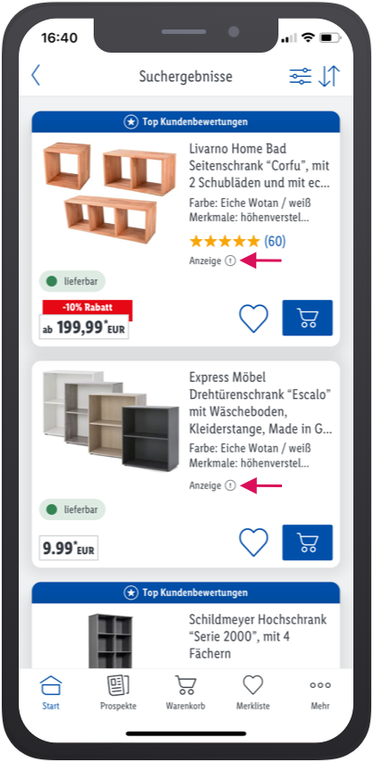
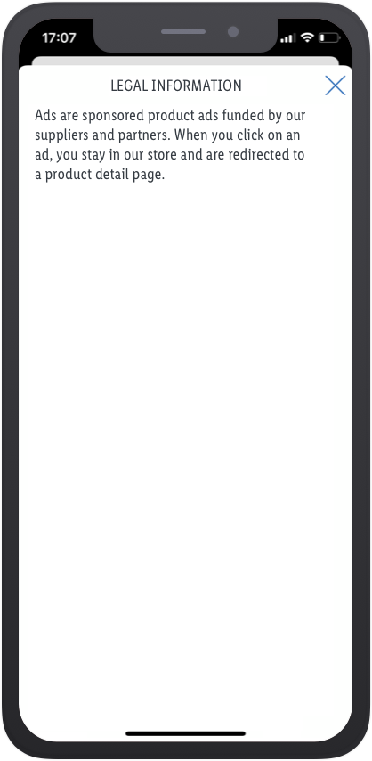
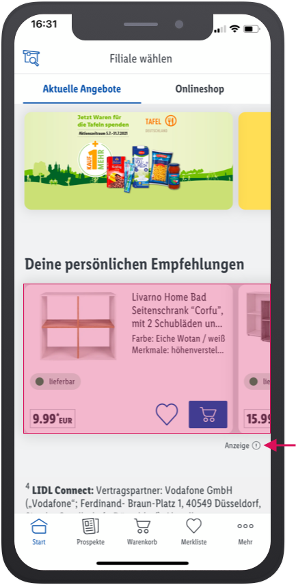
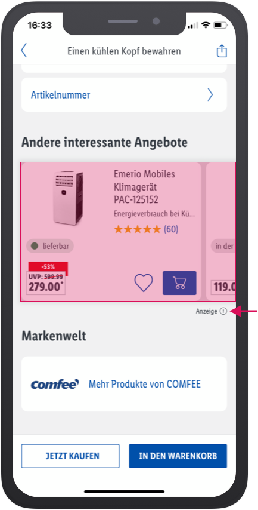

# Product Listing Ad

Product Listing Ads (PLA) are product ads which are shown when a user comes across a specific product, based on relevant user or keyword data.
You can choose the products you want to sponsor for certain use cases. But it is not possible to customize the products themselves with special content, unlike page banners.

##Product tile

A single product tile can displaying a personalized product recommendation based on available data such as previously viewed items. It is also possible to use this element as placement for a sponsored product.

The single tile will be embedded for example within the search results page.

### Example

_This is a non-obligatory example._

---

### Modal view/sheet requirement

Tapping on the ad-tag triggers modal view/sheet and can contain the following text: "**Ads are sponsored product ads funded by our suppliers and partners. When you click on an ad, you stay in our store and are redirected to a product detail page**".

_This is a non-obligatory example._

## Recommendation slider

A recommendation slider is displaying multiple personalized product recommendations based on available data such as previously viewed items. It is also possible to use this element as placement for sponsored products.

The slider will be embeded for example within the start page or other product detail pages.

### Examples

Start page | Product detail page |
---------|----------|
  |  |

_These are non-obligatory examples._
